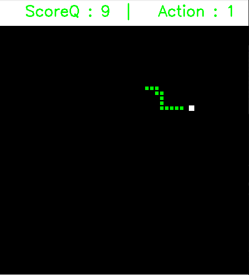
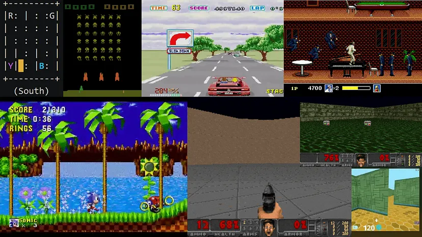
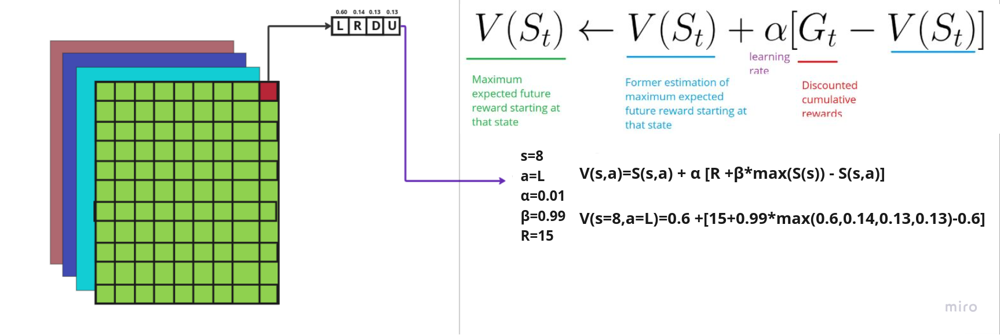
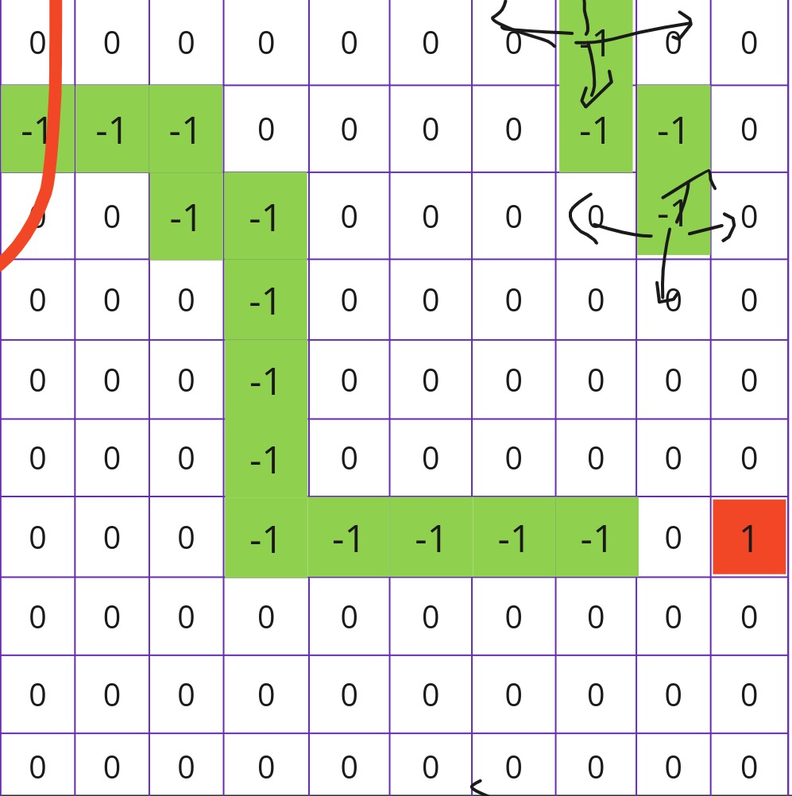
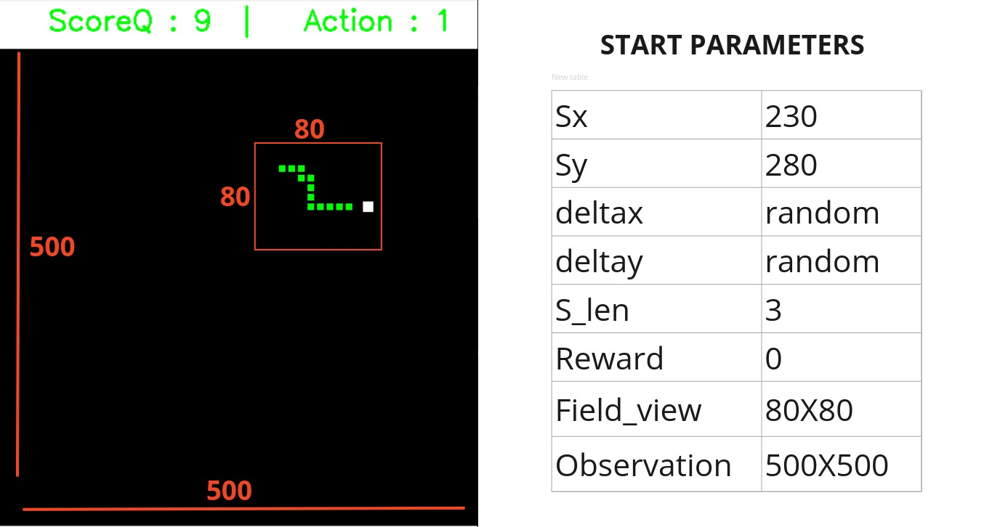
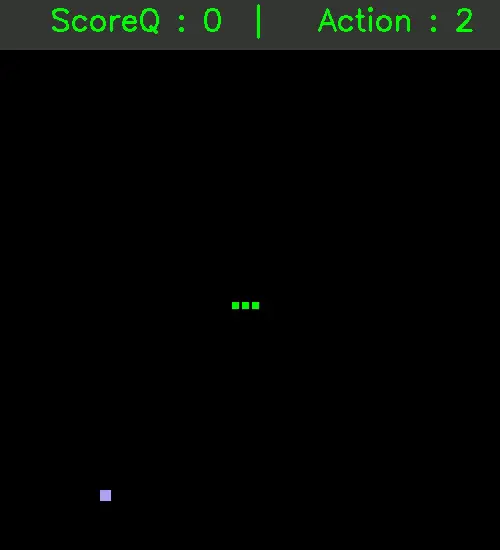
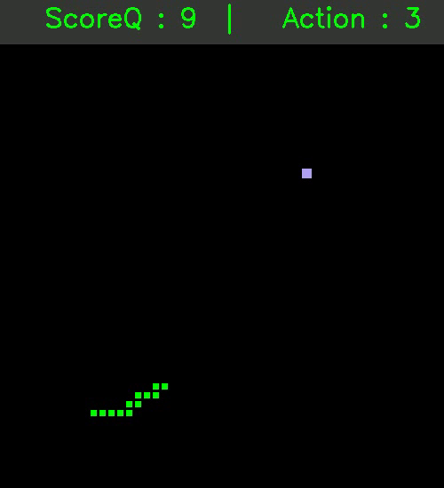

# *PROJECT NAME : REINFORCEMENT LEARNING SNAKEGAME*

 

<a src="show/sunum_learning.mp4"> </img> </a>

 

### Python kullanarak oluşturduğum bu uygulama,yapay zeka alanında yeni gelişmekte olan pekiştirmeli öğrenmeye (reinforcement learning - RL) bir örnektir.
<i>This application, which I created using Python, is an example of reinforcement learning, which is a new development in the field of artificial intelligence.</i>

 

### Pekiştirmeli öğrenme (RL) konusunu biraz daha açarsak; makine öğrenmesinin bir alt dalı olan bu öğrenme metodu kimilerince Q-Öğrenme (Q-Learning) olarak da adlandırılır. Temel olarak RL algoritmaları belirli bir hedefe en kısa sürede ve en iyi yolu bulmaya yönelik bir yöntemdir. Bunu yaparken geçmiş hareketlerini optimize etmiş olduğu bir tabloda depolaması olan Q-tablo kullanılır. Özellikle bu yöntem, robotik alanında belirli bir sorunu çok hızlı ve çok daha doğru bir şekilde çözmek için kullanılır. Bu işlemi gerçekleştirirken Q-tablo optimizasyonunu Bellman denklemi adı verilen bir optimizasyon fonksiyonuyla gerçekleştirir.

<i>If we delve deeper into the topic of Reinforcement Learning (RL); this learning method, which is a subfield of machine learning, is also known as Q-Learning by some. Fundamentally, RL algorithms aim to find the shortest and best path to reach a specific goal. In doing so, they use a Q-table that optimizes past actions. Particularly, this method is used in robotics to overcome a given problem much faster and more accurately. During this process, Q-table optimization is achieved through an optimization function called the Bellman equation.</i>

 
 

 </img>

### Bellman denklemi, önceki hareketleri unutmadan yeni hareketlerle optimizasyon sağlar. Bu yöntem sayesinde modelin verileri unutması önlenirken yeni değerlerin de modele iyi bir şekilde işlenmesi sağlanır. Şu anda bu makine öğrenme yaklaşımı yeni olduğundan, bununla ilgili araştırmalar ve yeni bulgular üzerinde çalışmalar yapılıyor. Son yıllarda bu büyüleyici araştırma alanında pek çok gelişme görüldü. Örnekler arasında 2014'te DeepMind ve Deep Q öğrenme mimarisi, 2016'da Go oyununun şampiyonunu AlphaGo ile yenmek, 2017'de ise OpenAI ve PPO yer alıyor.

<i>The Bellman equation ensures optimization with new actions without forgetting previous ones. This method prevents the model from forgetting its data while also effectively processing new values in the model. Since this machine learning approach is relatively new, research and studies are ongoing to explore it further and discover new findings. In recent years, we have seen significant developments in this fascinating research area. Examples include DeepMind and the Deep Q learning architecture in 2014, AlphaGo defeating the world champion in the game of Go in 2016, and OpenAI and PPO in 2017.</i>

 
 

 </img>

### Pekiştirmeli öğrenme sorunlarını çözmek için günümüzde kullanılan farklı mimariler bulunmaktadır. Bunlar arasında Q-öğrenme, Derin Q-öğrenme, Politika Aşamaları, Aktör-Eleştirmen ve PPO yer almaktadır. Bu projede PPO algoritmasından faydalanılmıştır. PPO (Proximal Policy Optimization), politika gradyanlarını birbirine yakın tutarak istikrarlı ve güvenilir bir şekilde politika güncellemeleri yapmayı amaçlar. Bu sayede ajanın (öğrenen model) performansı daha tutarlı bir şekilde geliştirilebilir. Politika, bir ajanın belirli bir durumda hangi eylemi seçeceğini belirleyen strateji veya karar alma sürecini ifade eder.

<i>To address the challenges of reinforcement learning, different architectures are used today. These include Q-learning, Deep Q-learning, Policy Gradients, Actor-Critic, and PPO. This project utilizes the PPO algorithm. PPO (Proximal Policy Optimization) aims to update policies stably and reliably by keeping policy gradients close to each other. This allows for more consistent improvement in the performance of the agent (learning model). Policy refers to the strategy or decision-making process that determines which action an agent will take in a specific state.</i>

 
 

# **PROJENİN TANITIMI : PROJECT PRESENTATION**

 

### **YILAN OYUNU : SNAKE GAME**

 

 </img> 
 </img>

<h4>Proje kapsamında yılan oyunu ortamını kullandım. Bu ortam, yılanın elma yemesi temelinde kurulu bir görevi içermektedir. Yılanın elma yemesi için en hızlı ve en doğru yolu belirlemek, bu görevin temel amacıdır. Ancak yılanın bu yolu takip ederken kendi kuyruğunu ısırması veya duvara çarpması, görevin başarısızlıkla sonuçlanmasına neden olacaktır. Bu projede yılanı eğitmek için pekiştirmeli öğrenme algoritması olan PPO algoritması kullanılmaktadır.Bu algoritma politika üzerinden optimizasyon sağlamaktadır. Politika, görevin başarılı olması durumunda (yani elma yemek), puan kazandırırken başarısızlıkla sonuçlanan durumları (kuyruk yeme, duvara çarpma) ise ceza olarak değerlendirir. </h4>

<i>In the scope of the project, I used the snake game environment. This environment is based on the snake eating apples. The main task in this environment is to determine the fastest and best path for the snake to reach the apple. However, if the snake bites its tail or hits the wall while following this path, the task will result in failure. In this task, the snake is trained using the reinforcement learning algorithm PPO algorithm.This algorithm provides optimization over policy. Within this policy, successfully completing the task (eating the apple) rewards points, while failures (biting the tail, hitting the wall) are classified as penalties.</i>

 

### **POLICY : POLITIKA**

 </img>

 

Proje kapsamında, PPO optimizasyon algoritması, verilen politikayı güncelleyerek yılanın görevi başarılı bir şekilde tamamlamasını sağlamaktadır. Bu görev için belirlenen politika parametreleri şunlardır: "Sx, Sy" (yılanın başının konumu), "deltax, deltay" (elmaya olan x ve y delta uzaklıkları), "S_len" (yılanın toplam uzunluğu), "Reward" (yılanın aldığı ödül), "Field_view" (yılanın görüş alanı) ve "observation" (çalışma ortamının boyutu). PPO, bu parametreleri kullanarak politikayı günceller ve optimizasyon algoritması aracılığıyla Q-tablo değerini günceller.

<i>Within the scope of the project, the PPO optimization algorithm updates the given policy to ensure the successful completion of the snake's task. The policy parameters for this task include "Sx, Sy" (the position of the snake's head), "deltax, deltay" (the x and y delta distances to the apple), "S_len" (the total length of the snake), "Reward" (the reward received by the snake while attempting the task), "Field_view" (the snake's field of view), and "observation" (the size of the environment in which the snake performs the task). PPO updates these values through its policy and updates the Q-table value through the optimization algorithm.</i>

 

### **REWARD : ÖDÜl**

  
     </img>
    <pre >

    #on eating apple
    if self.snake_head == self.apple_position:
        reward=+10
    if self.done:
        reward=-10
    </pre>

 

 
Pekiştirmeli öğrenme algoritmalarında, algoritmanın optimizasyon fonksiyonları diğer algoritmalar dan farklı olarak minimize yerine maximize etmeyi hedefler ve bunun için reward (ödül) parametresini kullanır. Bu değer, görevin maximize edici parametresidir. Görevin doğruluğu, ödül değerinin yüksek olması ile doğru orantılıdır. Ödül ne kadar yüksekse, görevin doğruluğu da o kadar yüksek olur; ancak unutulmaması gereken, ödül sisteminin doğru olmasıdır. Ödül sistemi, görevin başarısız olma yönünde eğimliyse o zaman görev başarısızlıkla sonuçlanır. Ödül sistemi, olabildiğince sade ve minimize edilirse, öğrenme o kadar hızlı ve doğru olacaktır.

<i>In reinforcement learning algorithms, the optimization functions of the algorithm aim to maximize instead of minimizing, unlike other algorithms, and they use the reward parameter for this purpose. This value is the maximizing parameter of the task. The accuracy of the task is directly proportional to the high reward value. The higher the reward, the higher the accuracy of the task; however, it should be noted that the reward system must be correct. If the reward system is inclined towards task failure, then the task will result in failure. The reward system, when kept as simple as possible and minimized, leads to faster and more accurate learning.</i>

 

  
     </img>
    <pre >
    <pre>
    new_calculation=self.calculate_distance(self.snake_head, self.apple_position)
    reward=((255-new_calculation)+eat_eppale)/100
    <pre>
    if self.done:
        reward=-(((50*50)-len(self.snake_position))/100)
        #(max snake body - snake body) 100
    </pre></pre>

 
Reward değerinin optimizasyonu için ilk başta basitleştirilip daha sonraki eğitimlerde yavaş yavaş karmaşıklaştırılması, öğrenmeyi daha kolay hale getirebilir. Deneyimlerimden anladığım kadarıyla, ilk başta sadece elmaya yakınlaşmayı hedefleyen bir ödül sistemi, daha hızlı bir yol bulmayı ve hayatta kalmayı sağlarken, sonraki eğitimlerde elmayı yemesi durumunda daha fazla puan kazanacağını öğrenen bir sistem daha hızlı öğrenmeyi kolaylaştırmaktadır. Daha sonra elma yemesini hızlandırmak için her adımda yılandan elmaya olan uzaklığın sigmoid fonksiyonuna eklenerek, elmaya yaklaşma durumunda en fazla +1, uzaklaştığında ise en az +0 puan verilerek ödülün daha yüksek olması sağlanmıştır. Dolayısıyla, bu şekilde eğitimin daha başarılı olacağı kanaatine vardım.

<i>The optimization of the reward value can be facilitated by initially simplifying it and gradually making it more complex in subsequent trainings, making learning easier. From my experiences, I have found that a reward system that initially aims only to approach the apple allows for quicker finding of a path and survival, while a system that learns to eat the apple in subsequent trainings, gaining more points for doing so, facilitates faster learning. To accelerate apple consumption later on, the distance from the snake to the apple is added to the sigmoid function at each step, giving a maximum reward of +1 when approaching the apple and at least +0 when moving away, ensuring a higher reward. Therefore, I have concluded that this approach leads to more successful training.</i>

  
 </img>
<pre >
<pre>

<pre>
# Increase Snake length on eating apple
def collision_with_apple(self):
        if self.snake_head == self.apple_position:
            self.score+=1
            self.pased = True
            return True

</pre>
<pre>
self.Game.collision_with_apple():
if self.Game.pased:                            
    step_reward=self.Game.score*10
</pre>
<pre>
reward=((250-new_calculation)/100+step_reward)/100
</pre>
<pre>
if self.done:
    reward=-(((50*50)-len(self.snake_position))/100)
    #(max snake body - snake body) 100
</pre>
</pre>

   

### **RUN : ÇALIŞTIRMAK**

 

### **Requireds : Gereklilikler**
<pre>
pip install gym==0.24.0
pip install collections
pip install opencv-python==4.8.1.78
pip install tqdm==4.66.1
pip install numpy==4.66.1
pip install stable_baselines3==2.2.1
pip install json5==0.9.14

</pre>
 

 Proje içinde dört dosya bulunmaktadır. Bunlar snake_env.py (oyun dosyası), snake_train.py (eğitim dosyası), pred.py (tahmin dosyası) ve start_env.py (manuel oynama) dosyalarıdır. Projeyi çalıştırmak için;

<i>There are four files in the project. These are snake_env.py (game file), snake_train.py (training file), pred.py (prediction file), and start_env.py (manual playing file). To run the project;</i>

**LİNUX**

<pre>
python3 pred.py 
</pre>

**Windows CMD**

<pre>
python pred.py 
</pre>